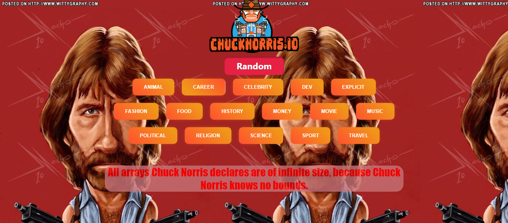

# App React- Fetch para el consumo de la Api Chuck Norris

Este proyecto se implemento usando react y fetch para realizar los llamados asyncronos de la Api Chuck Norris para mostrar las categorias disponibles y para ver chistes de forma aleatoria

A continuación se muestra el estado final de la aplicación:

[App React para el llamado de la Api Chuck Norris]

### Pasos para descargar la aplicación
- Clonar el repositorio
- Ejecutar el comando [npm install] en la terminal para crear la carpeta node_modules
- Ejecutar la aplicación en la terminal con el comando [npm run start]

### Author
[@LilianaGallego](https://github.com/LilianaGallego) - Martha Liliana Gallego Murillo